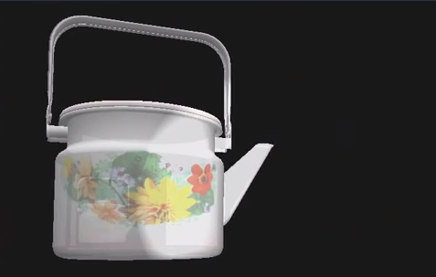

# Translucent Objects Lighting 
This repository shows demos from differentes techniques that aim to light translucent objects up using OpenGL 4.3.
Techniques implemented: Forward rendering, Deferred rendering and Order Independent Transparency (OIT)

## Requirements 
 - GLAD
 - GLFW
 - GLUT
 - GLM
 - ASSIMP
 

## Build steps 

Make sure you are using an out of place build, by making a build directory and compiling the code there.

  mkdir build
	cd build
	cmake ..
  make
  ./graphics

  ## Result
  
  
  
  
  ## Video Demo
  
  https://drive.google.com/open?id=1VCPB5fBejrYAxKCkYjRleL1vvdgiNiSz
  
